# SmartBank AI 🏦
> Full-stack intelligent banking platform with real-time XGBoost fraud detection and Groq LLaMA AI explanations


---

## 🌐 Live Demo

| Service | URL |
|---|---|
| Frontend | https://smartbank-ai-snowy.vercel.app |
| Backend API | https://smartbank-ai-backend.onrender.com |

**Demo credentials**
```
Email:    test@example.com
Password: SmartBank123!
```

> ⚠️ The backend runs on Render's free tier — first request may take 30 seconds to wake up.

---

## 🎯 ML Model Performance

Trained on the [Kaggle Credit Card Fraud Dataset](https://www.kaggle.com/datasets/mlg-ulb/creditcardfraud) — 284,807 real transactions, 0.17% fraud rate.

| Metric | Score |
|---|---|
| ROC-AUC | **97.34%** |
| Fraud Precision | **80%** |
| Fraud Recall | **84%** |
| Normal Transaction Accuracy | **100%** |
| Training Samples | **284,807** |
| Inference | **Real-time** |

---

## 🏗️ System Architecture

```
┌─────────────────────────────────────────┐
│         React Frontend (Vercel)          │
└──────────────────┬──────────────────────┘
                   │ HTTPS + JWT
┌──────────────────▼──────────────────────┐
│      Node.js + Express API (Render)      │
│         JWT Auth · bcrypt · CORS         │
└────────┬─────────────────────┬──────────┘
         │                     │
┌────────▼──────┐   ┌──────────▼──────────┐
│  PostgreSQL   │   │  FastAPI ML Service  │
│  (Neon Cloud) │   │  XGBoost Model       │
│               │   │  ROC-AUC: 97.3%      │
└───────────────┘   └──────────┬──────────┘
                               │
                    ┌──────────▼──────────┐
                    │  Groq LLaMA 3.1     │
                    │  AI Fraud Explainer  │
                    └─────────────────────┘
```

---

## ✨ Features

### 🔐 Authentication
- JWT-secured login and registration
- bcrypt password hashing (salt rounds: 10)
- Session management with localStorage / sessionStorage
- Failed attempt tracking with account lockout

### 🏦 Banking
- Multi-account management (savings + current)
- Real-time deposits and money transfers
- Account number generation
- Account freeze support (admin)

### 🚨 AI Fraud Detection
- **XGBoost ML model** trained on 284,807 real transactions
- Real-time risk scoring on every transfer (0.0 – 1.0)
- **Groq LLaMA 3.1** generates plain-English fraud explanations
- Fraud flags stored in database with full audit trail
- Blocking confirmation modal for high-risk transfers

### 📊 Analytics & Reporting
- Monthly inflow / outflow bar charts (canvas-based, no Chart.js)
- Transaction type breakdown donut chart
- AI-powered spending insights via Groq
- Fraud rate statistics panel
- PDF bank statement export (browser print API)

### 🗂️ Transaction History
- Full paginated transaction log
- Filter by type (deposit / transfer / withdrawal) and risk status
- Search by name, account number, or amount
- Expandable AI explanation rows for flagged transactions
- PhonePe-style "To / From" recipient display

---

## 📸 Screenshots

### Login & Register
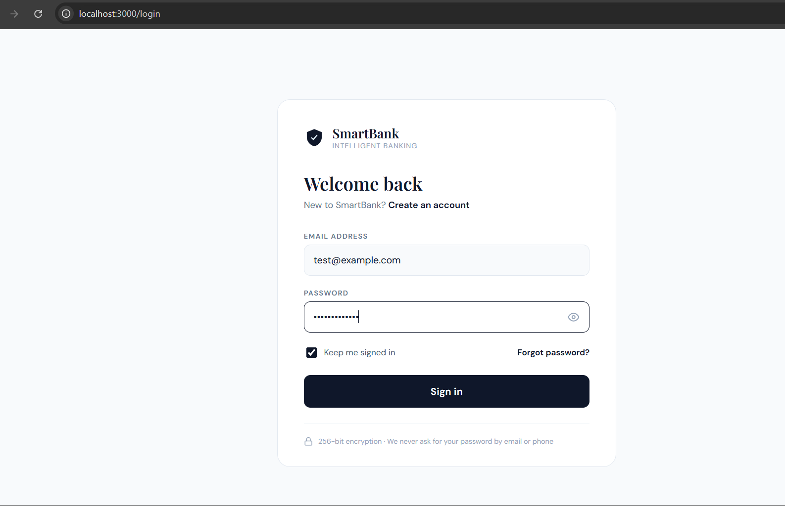
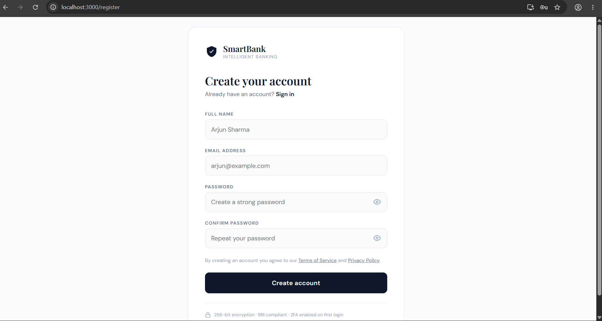

### Dashboard
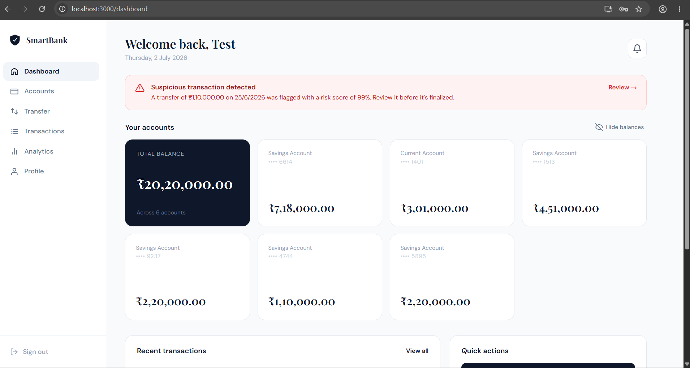
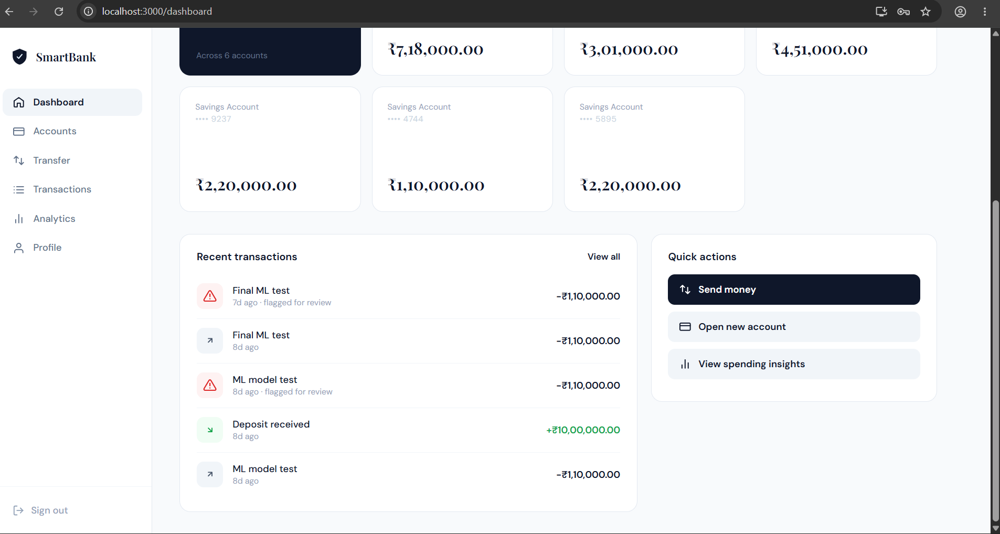

### Accounts
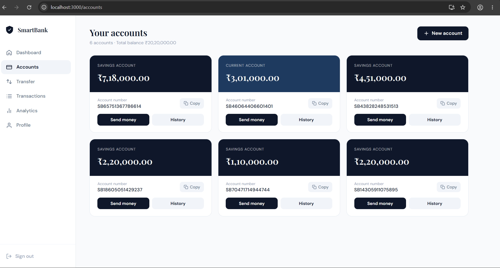

### Transfer + AI Fraud Detection
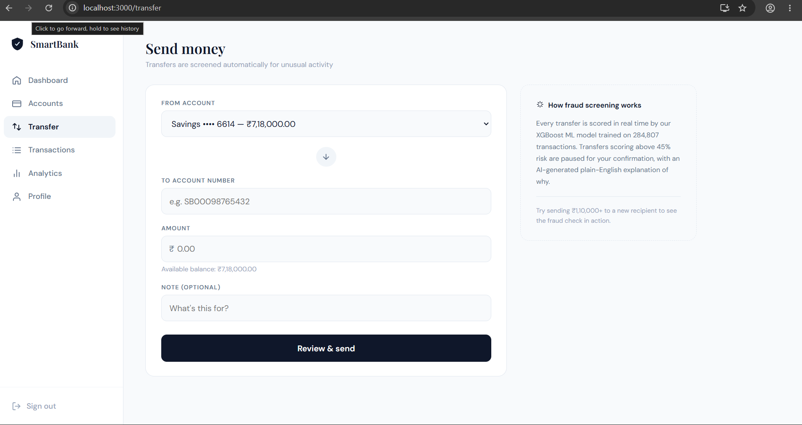
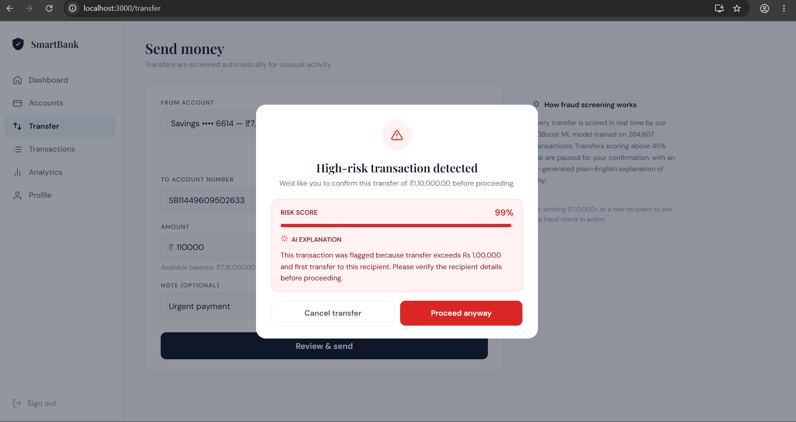
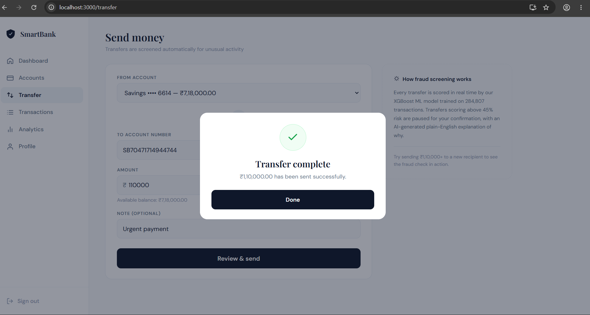

### Transaction History
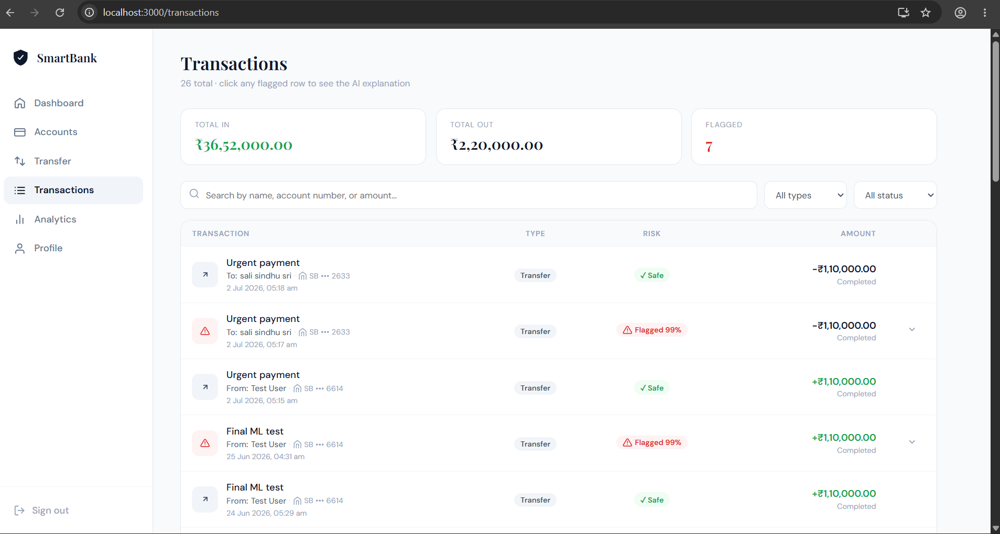
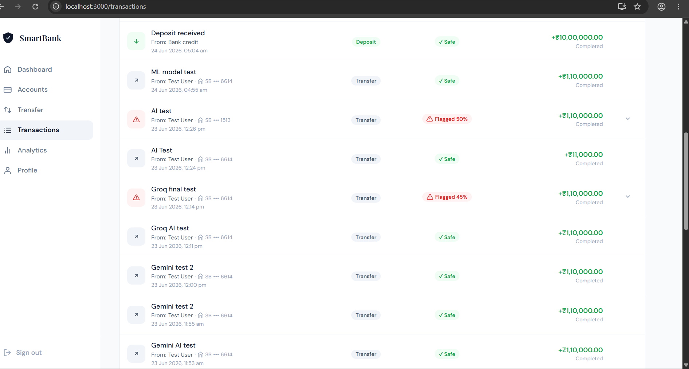

### Analytics
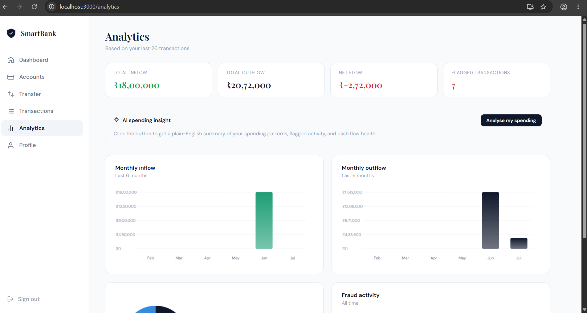
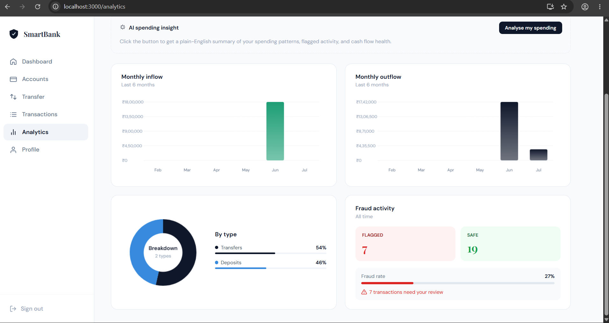

### Profile
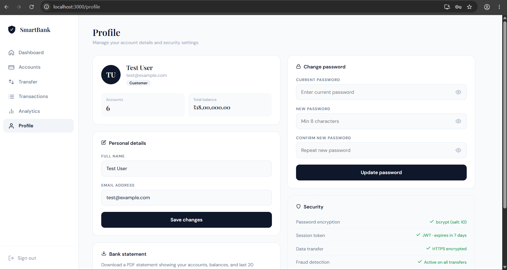
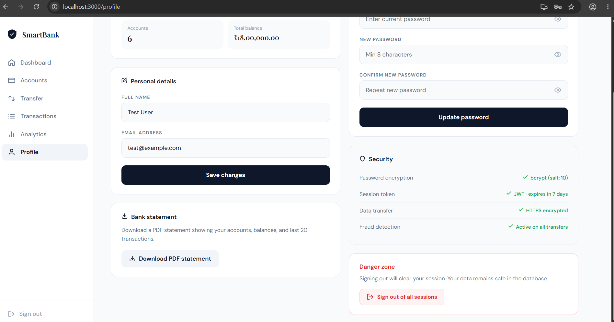

---

## 🛠️ Tech Stack

| Layer | Technology | Purpose |
|---|---|---|
| Frontend | React.js, React Router | UI, routing, state management |
| Backend | Node.js, Express.js | REST API, business logic |
| Auth | JWT, bcrypt | Secure authentication |
| Database | PostgreSQL on Neon | Persistent data storage |
| ML Model | XGBoost, scikit-learn | Fraud risk scoring |
| ML Service | Python, FastAPI | ML microservice |
| GenAI | Groq LLaMA 3.1 | Plain-English fraud explanations |
| Deployment | Vercel + Render | Frontend + backend hosting |

---

## 🚀 Running Locally

### Prerequisites
- Node.js 18+
- Python 3.10+
- PostgreSQL database (or free [Neon](https://neon.tech) account)
- [Groq API key](https://console.groq.com) (free)

### 1 · Clone the repo
```bash
git clone https://github.com/sindhusali/smartbank-ai.git
cd smartbank-ai
```

### 2 · Backend
```bash
cd backend
npm install
```

Create `backend/.env`:
```env
PORT=5000
DATABASE_URL=your_neon_postgresql_connection_string
JWT_SECRET=your_random_secret_key
GROQ_API_KEY=your_groq_api_key
```

```bash
npm run dev
# Server running on http://localhost:5000
```

### 3 · Database
Run `backend/db/schema.sql` against your PostgreSQL database to create all 5 tables.

### 4 · ML Service
```bash
cd ../ml-service
python -m venv venv
venv\Scripts\activate        # Windows
# source venv/bin/activate   # Mac/Linux
pip install -r requirements.txt
python train.py              # Train the XGBoost model (~2 mins)
uvicorn main:app --reload --port 8000
# ML service running on http://localhost:8000
```

> Download the [Kaggle credit card fraud dataset](https://www.kaggle.com/datasets/mlg-ulb/creditcardfraud) and place `creditcard.csv` in the `ml-service/` folder before training.

### 5 · Frontend
```bash
cd ../frontend
npm install
npm start
# App running on http://localhost:3000
```

---

## 📁 Project Structure

```
smartbank-ai/
├── frontend/                 # React application
│   └── src/
│       ├── pages/            # Login, Register, Dashboard, Accounts,
│       │                     # Transfer, Transactions, Analytics, Profile
│       └── components/       # PrivateRoute, shared components
│
├── backend/                  # Node.js + Express API
│   ├── routes/               # auth.js, accounts.js, transactions.js
│   ├── middleware/            # auth.js (JWT verification)
│   ├── services/             # aiExplainer.js (Groq integration)
│   └── db/                   # schema.sql, index.js (connection pool)
│
└── ml-service/               # Python FastAPI ML microservice
    ├── main.py               # FastAPI app + /predict endpoint
    ├── train.py              # XGBoost training script
    └── requirements.txt      # Python dependencies
```

---

## 🔌 API Endpoints

| Method | Endpoint | Description | Auth |
|---|---|---|---|
| POST | `/api/auth/register` | Register new user | ❌ |
| POST | `/api/auth/login` | Login + get JWT | ❌ |
| GET | `/api/accounts` | Get user accounts | ✅ |
| POST | `/api/accounts` | Create new account | ✅ |
| GET | `/api/transactions` | Get transaction history | ✅ |
| POST | `/api/transactions/deposit` | Deposit money | ✅ |
| POST | `/api/transactions/transfer` | Transfer + fraud check | ✅ |

---

## 🧠 How Fraud Detection Works

```
User initiates transfer
        ↓
Node.js backend calls FastAPI ML service
        ↓
XGBoost model scores the transaction (0.0 – 1.0)
based on: amount vs average, recipient history,
transfer frequency, time of day
        ↓
Score ≥ 0.45 → Flagged
        ↓
Groq LLaMA 3.1 generates plain-English explanation
"This transaction was flagged because the amount of
₹1,10,000 exceeds your usual transfer range and is
being sent to a first-time recipient..."
        ↓
Frontend shows blocking fraud modal with AI explanation
User can cancel or proceed
        ↓
Transaction + fraud flag saved to PostgreSQL
```

---

## 👩‍💻 Author

**Sali Sindhu Sri**

[](https://linkedin.com/in/sindhu-sri-sali-6867463b2/)
[](https://github.com/sindhusali)
[](https://sindhusali.github.io/sindhusrisali.github.io/)

---

## 📄 License

MIT License — feel free to use this project as a reference or template.
